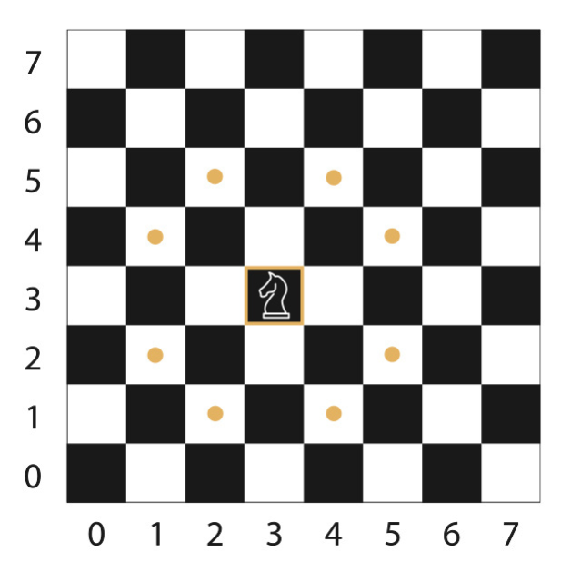

# odin-knights-travails

a function knightMoves that shows the shortest possible way to get from one square to another by outputting all squares the knight will stop on along the way.

A knight in chess can move to any square on the standard 8x8 chess board from any other square on the board, given enough turns. Its basic move is two steps forward and one step to the side or one step forward and two steps to the side. It can face any direction.

All the possible places you can end up after one move look like this:


Tips:

1. Think about the rules of the board and knight, and make sure to follow them.
2. For every square there is a number of possible moves, choose a data structure that will allow you to work with them. Don’t allow any moves to go off the board.
3. Decide which search algorithm is best to use for this case. Hint: one of them could be a potentially infinite series.
4. Use the chosen search algorithm to find the shortest path between the starting square (or node) and the ending square. Output what that full path looks like, e.g.:

````
  > knightMoves([3,3],[4,3])
  => You made it in 3 moves!  Here's your path:
    [3,3]
    [4,5]
    [2,4]
    [4,3]
    ```
````
